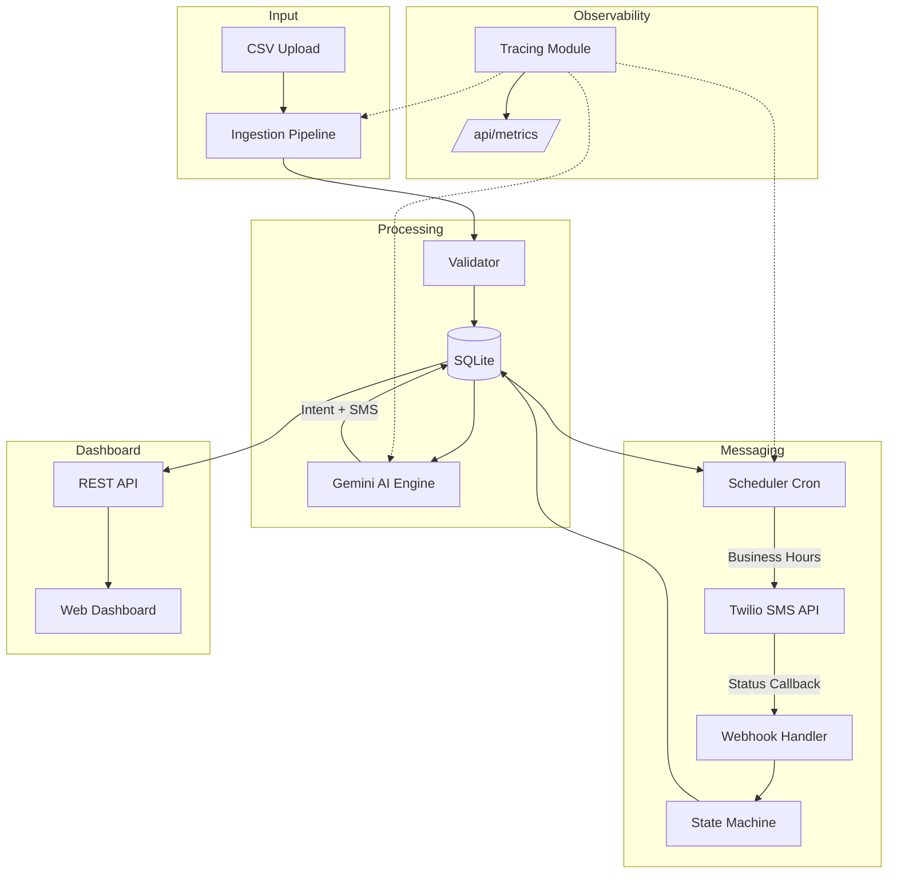
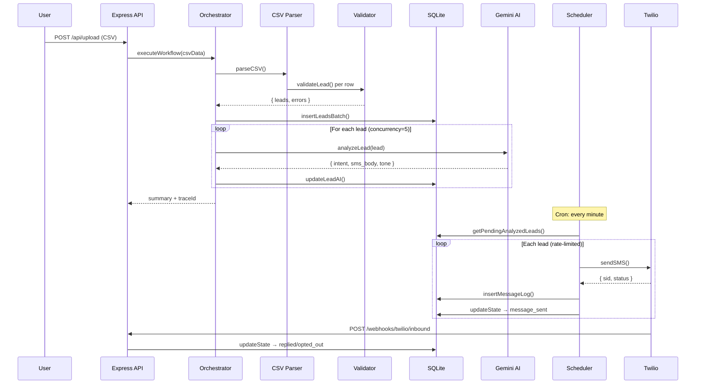
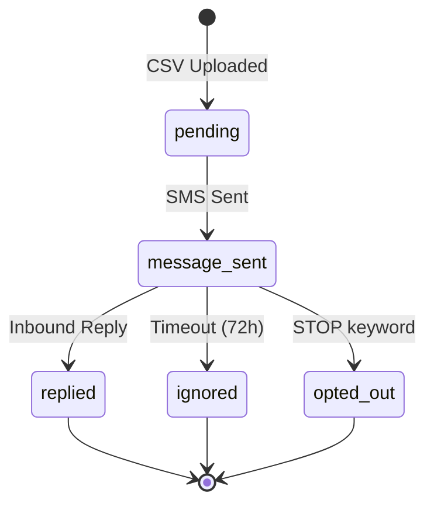

# System Architecture

## Overview

The Lead Reactivation Agent is a modular, autonomous AI system that processes dormant leads through a multi-stage pipeline: **Ingest → Analyze → Message → Track → Visualize**.

## Agent Workflow Sequence

## Lead State Machine

## Data Model

| Table | Key Columns | Purpose |
|-------|------------|---------|
| `leads` | lead_id (PK), full_name, phone_number, intent_category, sms_body, state | Lead lifecycle |
| `message_log` | id (PK), lead_id (FK), twilio_sid, direction, body, intent_score | Audit trail |

## Observability

- **Trace Contexts**: Each workflow run gets a unique `traceId` with nested spans per stage
- **Spans**: `csv_parse`, `deduplication`, `db_insert`, `ai_analysis`, `ai_batch`, `ai_lead_analysis`
- **Counters**: `workflow.started`, `workflow.completed`, `ai.intent.*`, `http.requests.*`
- **Histograms**: `workflow.duration_ms`, `ai.analysis.duration_ms`, `http.request.duration_ms`
- **Endpoint**: `GET /api/metrics` returns counters, histograms (with p50/p95/p99), and recent traces

## API Endpoints

| Method | Path | Description |
|--------|------|-------------|
| POST | /api/upload | CSV upload → triggers workflow |
| GET | /api/leads | Paginated lead list with filters |
| GET | /api/leads/:id | Lead detail + message history |
| GET | /api/analytics | Aggregated KPIs |
| GET | /api/analytics/reply-times | Reply time distribution |
| GET | /api/sources | Distinct lead sources |
| GET | /api/metrics | Observability: counters, histograms, traces |
| GET | /api/export | CSV export of all leads |
| POST | /api/webhooks/twilio/inbound | Inbound SMS webhook |
| POST | /api/webhooks/twilio/status | Delivery status callback |
